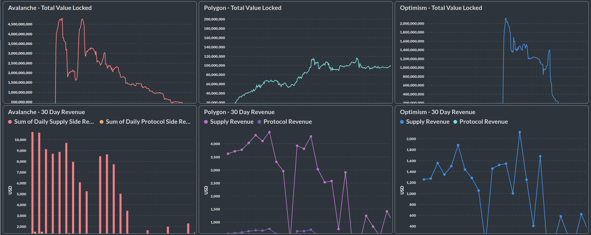

# DappLooker Analyzer

[DappLooker Analyzer](https://analytics.dapplooker.com/) is the easy, open-source way for everyone to build beautiful Charts and Dashboards.

## Features

- Let anyone on your team build charts without knowing SQL.
- Use the SQL editor for more complex queries.
- Build handsome, interactive dashboards with filters, auto-refresh, fullscreen, and custom click behavior.
- Create models that clean up, annotate, and/or combine raw tables.
- Define canonical segments and metrics for your community to use.
- Embed charts and dashboards in your app.
- Share Dashboards and charts which can be used by your community
- ... and [many more](https://dapplooker.notion.site/dapplooker/Dapplooker-Documentation-f3113336bdce4ecea688fa0ba69cec98)

Take a [tour of Analyzer](https://www.youtube.com/watch?v=JVgheSmgg1s)

## Resources

- [DappLooker Features](https://dapplooker.com/#features)
- [Network Integrations Details](https://dapplooker.com/integration)
- [Charts/Dashboards Explorer](https://dapplooker.com/explorer)
- [Ecosystem Partners](https://dapplooker.com/#partner)
- [Documentation](https://dapplooker.notion.site/dapplooker/Dapplooker-Documentation-f3113336bdce4ecea688fa0ba69cec98)
